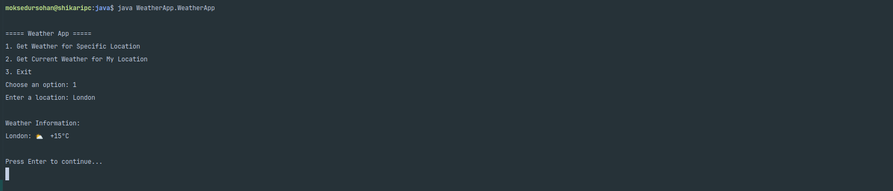

# WeatherApp

WeatherApp is a simple Java console application that provides weather information for specific locations and the user's current location.



## Features

- Get weather information for a specific location
- Fetch weather for the user's current location (based on IP geolocation)
- Simple console-based user interface
- Real-time weather data fetched from wttr.in API

## Error Handling

The application includes robust error handling for various scenarios:

- Invalid user inputs are caught and re-prompted
- Network connectivity issues are detected and reported to the user
- Invalid URLs or API response errors are handled gracefully
- Geolocation failures are communicated clearly

## How to Run the Project

1. Ensure you have Java Development Kit (JDK) installed on your system.

2. Clone this repository or download the `WeatherApp.java` file.

3. Open a terminal or command prompt and navigate to the directory containing `WeatherApp.java`.

4. Compile the Java file:
   ```
   javac WeatherApp.java
   ```

5. Run the compiled program:
   ```
   java WeatherApp
   ```

6. Follow the on-screen prompts to interact with the application.

## Dependencies

This project uses the following external APIs:

- [wttr.in](https://wttr.in/) for weather data
- [ip-api.com](http://ip-api.com/) for IP-based geolocation

No additional libraries or dependencies are required beyond the Java standard library.
